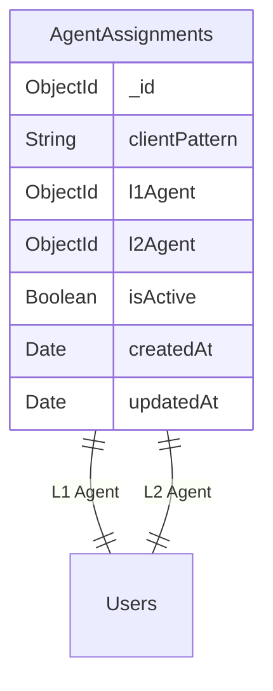
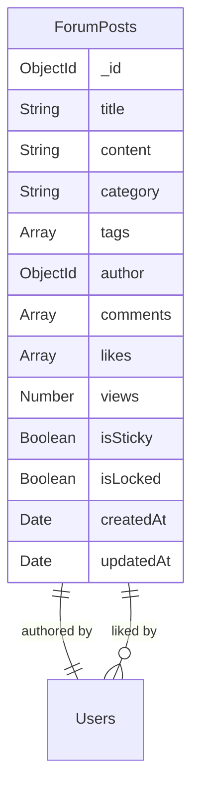
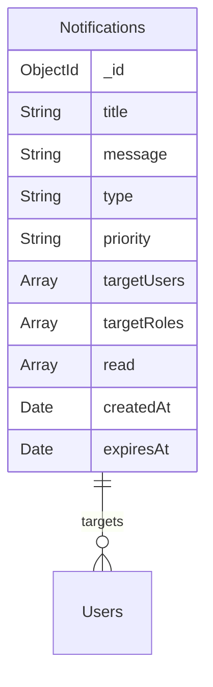

I'll create a database documentation that explains the relationships between different collections and their schema structures.

````markdown:database_documentation.md
# Database Documentation

## Database Schema and Relationships

### Overview
The ticketing system uses MongoDB with Mongoose ODM, implementing several interconnected collections to manage tickets, users, forums, notifications, and agent assignments.

## Collections and Relationships

### 1. Users Collection
**Model: UserModel**
- Primary collection for all user data
- Referenced by: Tickets, Forums, Notifications, AgentAssignments

```mermaid
erDiagram
    Users {
        ObjectId _id
        String name
        String username
        String email
        String password
        String role
        Array notifications
    }
````

### 2. Tickets Collection

**Model: TicketModel**

-   Stores all ticket information
-   References:
    -   createdBy → Users.\_id
    -   assignedTo → Users.\_id
    -   responses.responder → Users.\_id

```mermaid
erDiagram
    Tickets {
        ObjectId _id
        String title
        String description
        String status
        String priority
        String category
        ObjectId createdBy
        ObjectId assignedTo
        Array responses
        Date createdAt
        Date updatedAt
    }
    Tickets ||--o{ Users : "created by"
    Tickets ||--o{ Users : "assigned to"
    Tickets ||--o{ Users : "responses by"
```

### 3. Agent Assignments Collection

**Model: AgentAssignmentModel**

-   Manages client-agent mappings
-   References:
    -   l1Agent → Users.\_id
    -   l2Agent → Users.\_id



### 4. Forum Collection

**Model: ForumModel**

-   Stores forum posts and comments
-   References:
    -   author → Users.\_id
    -   comments.author → Users.\_id
    -   likes → Users.\_id



### 5. Notifications Collection

**Model: NotificationModel**

-   Manages system notifications
-   References:
    -   targetUsers → Users.\_id
    -   read.user → Users.\_id



## Key Relationships

### User-Ticket Relationship

-   One-to-Many: User can create multiple tickets
-   One-to-Many: Agent can be assigned multiple tickets
-   Many-to-Many: Users can respond to multiple tickets

### User-Agent Assignment Relationship

-   One-to-Many: L1/L2 Agent can be assigned to multiple client patterns
-   Many-to-One: Multiple clients can be mapped to one agent pair

### User-Forum Relationship

-   One-to-Many: User can create multiple forum posts
-   Many-to-Many: Users can like multiple posts
-   One-to-Many: User can create multiple comments

### User-Notification Relationship

-   Many-to-Many: Notifications can target multiple users
-   Many-to-Many: Users can receive multiple notifications

## Indexing Strategy

### Users Collection

```javascript
{
    username: 1,      // Unique index
    email: 1,         // Unique index
    role: 1          // Frequently queried
}
```

### Tickets Collection

```javascript
{
    createdBy: 1,     // Frequent user queries
    assignedTo: 1,    // Agent queries
    status: 1,        // Status filtering
    updatedAt: -1     // Sorting by latest
}
```

### Agent Assignments Collection

```javascript
{
    clientPattern: 1, // Unique index
    l1Agent: 1,       // Agent queries
    l2Agent: 1        // Agent queries
}
```

### Forum Posts Collection

```javascript
{
    author: 1,        // Author queries
    category: 1,      // Category filtering
    isSticky: -1,     // Sticky posts first
    createdAt: -1     // Latest posts
}
```

### Notifications Collection

```javascript
{
    targetUsers: 1,   // User specific notifications
    targetRoles: 1,   // Role based notifications
    createdAt: -1     // Latest first
}
```

## Data Flow Examples

### Ticket Creation Flow

1. Client creates ticket
2. System finds agent assignment based on client username
3. Ticket is assigned to L1 agent
4. Notification is created for L1 agent
5. Email notification is sent

### Ticket Escalation Flow

1. L1 agent escalates ticket
2. System finds L2 agent from assignment
3. Ticket status updated to 'escalated'
4. Notification created for L2 agent
5. Email notification sent to L2 agent

## Data Integrity Rules

1. **User Deletion**

    - Archive associated tickets
    - Remove from agent assignments
    - Archive forum posts
    - Delete notifications

2. **Agent Role Change**

    - Update agent assignments
    - Reassign active tickets
    - Update notifications

3. **Ticket Status Changes**
    - Create notification records
    - Update assignment if escalated
    - Send email notifications

## Performance Considerations

1. **Pagination**

    - All list endpoints implement pagination
    - Default limit: 10 items per page
    - Maximum limit: 100 items per page

2. **Compound Indexes**

    - Used for frequently combined queries
    - Optimized for sorting and filtering

3. **Data Archival**
    - Resolved tickets older than 90 days
    - Read notifications older than 30 days
    - Closed forum posts older than 180 days

```

This documentation provides a comprehensive overview of:
1. Database structure and relationships
2. Collection schemas
3. Indexing strategies
4. Data flow examples
5. Data integrity rules
6. Performance considerations

Would you like me to expand on any particular section or add additional information?
```
